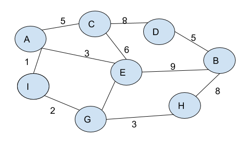

# Problem Solving

## Project Setup
```
git clone git@github.com:mahfuzsust/problem-solving.git
```

## Directory Structure

__models__ folder contains all the models <br>
__src__ folder contains the module that solve each problem ([first.py](src/first.py), [second.py](src/second.py), [third.py](src/third.py)) <br>
__test__ folder contains the unit tests for those modules

## Run Unit Test
```
python -m unittest discover test
```

## Solution approach

### Finding maximum value in a rotated sorted array [sorted_list_max](src/sorted_list_max.py):
Recursively breaking down the array in the middle to find the value not showing any order. Getting maximum at each step so that if it contains only the sorted array then it will get the maximum from the last value

### Finding common node in the shortest path [common_shortest_node](src/common_shortest_node.py)



Finding the shortest path from source to destination node using Dijkstra algorithm. Then a single loop shrinking down from the both end to get the common node that can be reached within the timeframe by the both node.


### Printing dictionary keys
Recursive function that will print each key and go to the next level after adding level count

### Printing dictionary keys and custom model
Recursive function that will check each node if it's a dictionary subset or custom model(__Person__). 
* For dictionary items, print the keys and go inside
* For person, print (first_name, last_name, father) and run again with the father node

### Lowest common ancestor
Taking into consideration that
* Each node will be unique and no duplication of node value <br>
<p>There will be given two nodes to find the common ancestor.</p>

* For the first node, all the parent nodes (including itself) are added to a dictionary ( Space complexit O(n)).
* For the second node, loop through all the parent nodes( including itself ) and check the value in the dictionary. If present that will be the lowest common ancestor

## Time Complexity
* Finding maximum value in a rotated sorted array: O(lgn)
* Finding common node in the shortest path: O(V^2)
* Printing dictionary keys recursively: O(n)
* Printing dictionary keys (custom model) recursively: O(n)
* Lowest common ancestor: O(n)